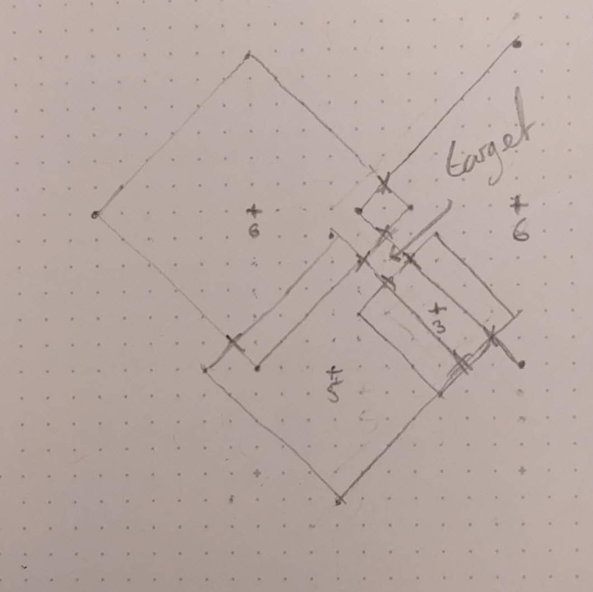
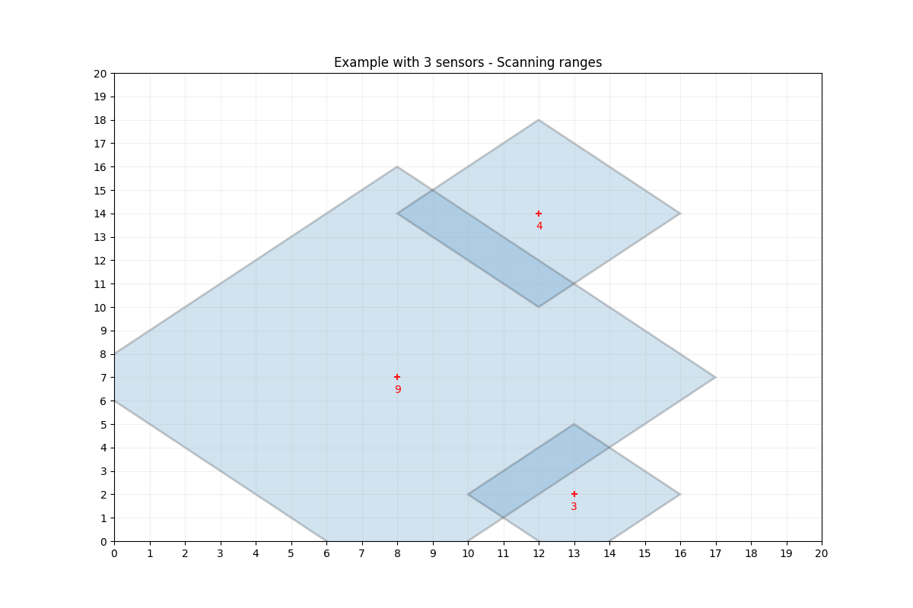

# Day 15: Beacon Exclusion Zone

## About the solution

When it came to part 2, the immediate realisation was that the location of the distress beacon; not being picked up by any of the sensors, must be immediately (i.e manhattan distance = 1) outside the range of multiple sensors.

I started by building a solution that would generate coordinates of each position immediately outside of the range of of each sensor, creating a perimeter of points _around_ the sensors rage. I then itterated through this large list of coordinates, until one was found that was outside of the range of all of the sensors. This worked well, but involved quite a lot of processing of points, taking ~30s to complete, which is obviously less than ideal.

From here I looked at how I could improve my solution. The next realisation is that we only really need to concern ourselves with the overlapping regions of each sensor, specifically, where they intersect with one another. If we look at the hastily drawn diagram below, showing the centerpoints of 4 sensors (denoted as a `+` icon), with their manhattan scanning ranges denoted below them.



Here we can see that the location of the distress beacon must be contained between 4 of sensor search areas. So the next step was to work out how we can calculate the points of intersection (marked with an `x`)between two sensor search area rectangles. If we can calculate this, then we can just seach the areas around each intersection to find the distress beacon.

It turns out the maths for calculating all the points of intersection between two diamonds is a bit involved. As I was going through this it became apparent that it was easier to consider each the search diamonds as simply 4 intersecting lines on a graph. Composed of two _positive_ lines with gradient `m = +1` (`y = x + c`) and two _negative_ lines with gradient `m = -1` (`y = -x + c`).

So the new iteration of the solution generates the four positive and negative lines for each sensor, and keeps hold of their y axis intersect locations (calculated as `c = y - x` for `m = +1` and `c = y + x` for `m = -1`). From here we can calculate the intersection of all of the positive lines with all of the negative lines using the [intersection formula](https://en.wikipedia.org/wiki/Intersection_(geometry)#Two_lines):


Where two lines are represented by
```math
\displaylines{c_1 = a_1x + b_1y \\ c_2 = a_2x + b_2y}
```

Which can be solved to yield

```math
\displaylines{x = \frac{b_2c_1 - b_1c_2}{a_1b_2 - a_2b_1} \\ y = \frac{a_1c_2 - a_2c_1}{a_1b_2 - a_2b_1}}
```

Plugging in our values:
```math
\displaylines{b_1 = b_2 = 1 \\ a_1 = 1 \\ a_2 = -1}
```

Yields the following simplified formula for calculating the x and y location of the intersect

```math
\displaylines{x = \frac{c_1 - c_2}{2} \\ y = \frac{c_1 + c_2}{2}}
```

We know that the area intersects we care about must intersect on whole numbers, so from here it is just a matter of calculating all the intersects that occur on integer locations within bounds. We know the distress beacon must be immediately outside of a sensors range, so to make life easier for ourselves we 'imagine' that the sensor's range is 1 unit larger than it is, and generate lines representing the perimeter of the sensor's range. From here we can simply calculate all the intersections and find the intersection that is not within any of the sensor's search areas, which represents the location of the distress beacon!

This solution is significantly faster, completing in a matter of miliseconds :) -

This is because while the below animation might look quite busy for the example data due to the imposed constraints in the coordinate system in the example, in the full data set the intersections are significantly more sparse, as we have relatively few sensors (32 in my data) to cover a 4 million square unit area, meaning we only have to check ~1500 locations to find the distress beacon.

Below is a nice visual to show the process for the sensors in the example (with the y axis going up instead of down) - both with a simple 3 sensor model, and the full set from the example.




## ⭐ Part 1 - Initial challenge

You feel the ground rumble again as the distress signal leads you to a large network of subterranean tunnels. You don't have time to search them all, but you don't need to: your pack contains a set of deployable **sensors** that you imagine were originally built to locate lost Elves.

The sensors aren't very powerful, but that's okay; your handheld device indicates that you're close enough to the source of the distress signal to use them. You pull the emergency sensor system out of your pack, hit the big button on top, and the sensors zoom off down the tunnels.

Once a sensor finds a spot it thinks will give it a good reading, it attaches itself to a hard surface and begins monitoring for the nearest signal source **beacon**. Sensors and beacons always exist at integer coordinates. Each sensor knows its own position and can **determine the position of a beacon precisely**; however, sensors can only lock on to the one beacon **closest to the sensor** as measured by the [Manhattan distance](https://en.wikipedia.org/wiki/Taxicab_geometry). (There is never a tie where two beacons are the same distance to a sensor.)

It doesn't take long for the sensors to report back their positions and closest beacons (your puzzle input). For example:

```
Sensor at x=2, y=18: closest beacon is at x=-2, y=15
Sensor at x=9, y=16: closest beacon is at x=10, y=16
Sensor at x=13, y=2: closest beacon is at x=15, y=3
Sensor at x=12, y=14: closest beacon is at x=10, y=16
Sensor at x=10, y=20: closest beacon is at x=10, y=16
Sensor at x=14, y=17: closest beacon is at x=10, y=16
Sensor at x=8, y=7: closest beacon is at x=2, y=10
Sensor at x=2, y=0: closest beacon is at x=2, y=10
Sensor at x=0, y=11: closest beacon is at x=2, y=10
Sensor at x=20, y=14: closest beacon is at x=25, y=17
Sensor at x=17, y=20: closest beacon is at x=21, y=22
Sensor at x=16, y=7: closest beacon is at x=15, y=3
Sensor at x=14, y=3: closest beacon is at x=15, y=3
Sensor at x=20, y=1: closest beacon is at x=15, y=3
```

So, consider the sensor at `2,18`; the closest beacon to it is at `-2,15`. For the sensor at `9,16`, the closest beacon to it is at `10,16`.

Drawing sensors as `S` and beacons as `B`, the above arrangement of sensors and beacons looks like this:

```
               1    1    2    2
     0    5    0    5    0    5
 0 ....S.......................
 1 ......................S.....
 2 ...............S............
 3 ................SB..........
 4 ............................
 5 ............................
 6 ............................
 7 ..........S.......S.........
 8 ............................
 9 ............................
10 ....B.......................
11 ..S.........................
12 ............................
13 ............................
14 ..............S.......S.....
15 B...........................
16 ...........SB...............
17 ................S..........B
18 ....S.......................
19 ............................
20 ............S......S........
21 ............................
22 .......................B....
```

This isn't necessarily a comprehensive map of all beacons in the area, though. Because each sensor only identifies its closest beacon, if a sensor detects a beacon, you know there are no other beacons that close or closer to that sensor. There could still be beacons that just happen to not be the closest beacon to any sensor. Consider the sensor at `8,7`:

```
               1    1    2    2
     0    5    0    5    0    5
-2 ..........#.................
-1 .........###................
 0 ....S...#####...............
 1 .......#######........S.....
 2 ......#########S............
 3 .....###########SB..........
 4 ....#############...........
 5 ...###############..........
 6 ..#################.........
 7 .#########S#######S#........
 8 ..#################.........
 9 ...###############..........
10 ....B############...........
11 ..S..###########............
12 ......#########.............
13 .......#######..............
14 ........#####.S.......S.....
15 B........###................
16 ..........#SB...............
17 ................S..........B
18 ....S.......................
19 ............................
20 ............S......S........
21 ............................
22 .......................B....
```

This sensor's closest beacon is at `2,10`, and so you know there are no beacons that close or closer (in any positions marked `#`).

None of the detected beacons seem to be producing the distress signal, so you'll need to work out where the distress beacon is by working out where it isn't. For now, keep things simple by counting the positions where a beacon cannot possibly be along just a single row.

So, suppose you have an arrangement of beacons and sensors like in the example above and, just in the row where `y=10`, you'd like to count the number of positions a beacon cannot possibly exist. The coverage from all sensors near that row looks like this:

```
                 1    1    2    2
       0    5    0    5    0    5
 9 ...#########################...
10 ..####B######################..
11 .###S#############.###########.
```

In this example, in the row where `y=10`, there are **26** positions where a beacon cannot be present.

Consult the report from the sensors you just deployed. **In the row where `y=2000000`, how many positions cannot contain a beacon?**


## ⭐⭐ Part 2 - Stretch challenge

Your handheld device indicates that the distress signal is coming from a beacon nearby. The distress beacon is not detected by any sensor, but the distress beacon must have `x` and `y` coordinates each no lower than `0` and no larger than `4000000`.

To isolate the distress beacon's signal, you need to determine its **tuning frequency**, which can be found by multiplying its `x` coordinate by `4000000` and then adding its `y` coordinate.

In the example above, the search space is smaller: instead, the x and y coordinates can each be at most `20`. With this reduced search area, there is only a single position that could have a beacon: `x=14, y=11`. The tuning frequency for this distress beacon is `56000011`.

Find the only possible position for the distress beacon. **What is its tuning frequency?**


## Quickstart

To generate solutions for this problem, simply invoke the `solution.py` file.

```bash
python solution.py
```
